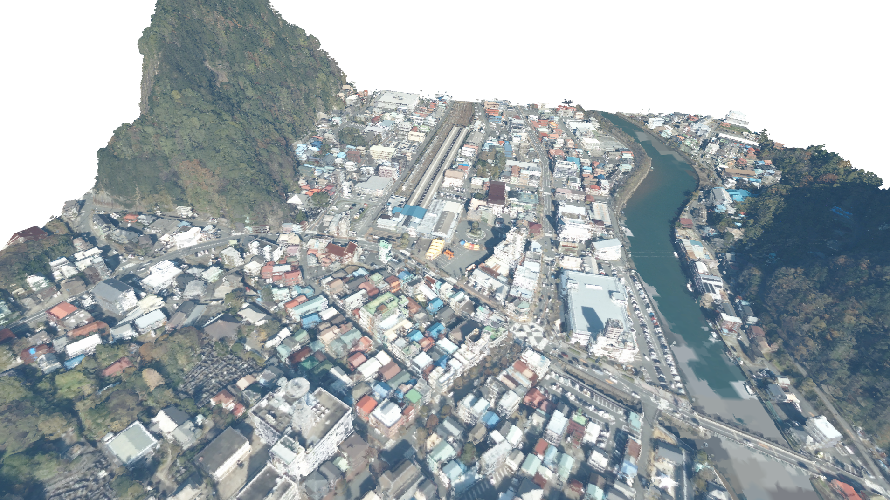

# Las2Mesh

点群(.las形式)ファイルを3Dモデルに変換するツールです。出力形式は、.ply, .stl, .obj, .off, .gltf, glb に対応しています。

## ダウンロード

- [v0.2](https://github.com/ksasao/Las2Mesh/releases/download/v0.2/las2mesh_v0.2.zip) (2022/04/11)
- [過去のバージョン](https://github.com/ksasao/Las2Mesh/releases)

## 利用方法

las2mesh.exe に 点群ファイル(.las) を Drag&Drop してください。複数まとめて Drag&Drop すると1つの3Dモデルとして出力されます。デフォルトのファイル名は output.ply です。出力形式は -o オプションで指定したファイル名の拡張子で自動判別します。なお、いずれも頂点カラーで出力されます。


[G空間情報センター 静岡県　富士山南東部・伊豆東部　点群データLPデータ](https://www.geospatial.jp/ckan/dataset/shizuoka-2019-pointcloud/resource/d5e98a7b-f15c-45b0-bf40-0287f5b1de68) の .las ファイルを用いて作成 (ライセンス: [クリエイティブ・コモンズ 表示](http://opendefinition.org/licenses/cc-by/))

### オプション

```txt
Las2Mesh v0.2
usage: las2mesh.py [-h] [-d DEPTH] [-o OUTPUT] [-n] [files ...]

.lasファイルからメッシュを生成します

positional arguments:
  files                 対象の .lasファイル。複数指定できます。

optional arguments:
  -h, --help            show this help message and exit
  -d DEPTH, --depth DEPTH
                        メッシュの細かさを整数で指定します。デフォルト値は 10 です。
  -o OUTPUT, --output OUTPUT
                        出力ファイル名を指定します。デフォルト値は output.ply です。出力形式は、.ply, .stl, .obj, .off, .gltf に対応しています。
  -n, --nopreview       3Dプレビュー表示を無効にします
```

## M1 Mac用環境設定

Pythonインストール
```
brew install python
```

python コマンドを有効にする
```
sudo ln -s /opt/homebrew/bin/python3 /opt/homebrew/bin/python
```

[Open3D](https://github.com/isl-org/Open3D)をビルドする ([see also](http://www.open3d.org/docs/release/compilation.html))
```
git clone https://github.com/isl-org/Open3D
cd Open3D
mkdir build
cd build
cmake ..

make -j$(sysctl -n hw.physicalcpu)
sudo make install
make install-pip-package
make python-package
make pip-package
```

Python用ライブラリをインストール
```
pip3 install numpy laspy pygltflib
```

変換テスト (Las2Meshをclone後)
```
cd src
python las2mesh.py test.las -o test.glb
```
